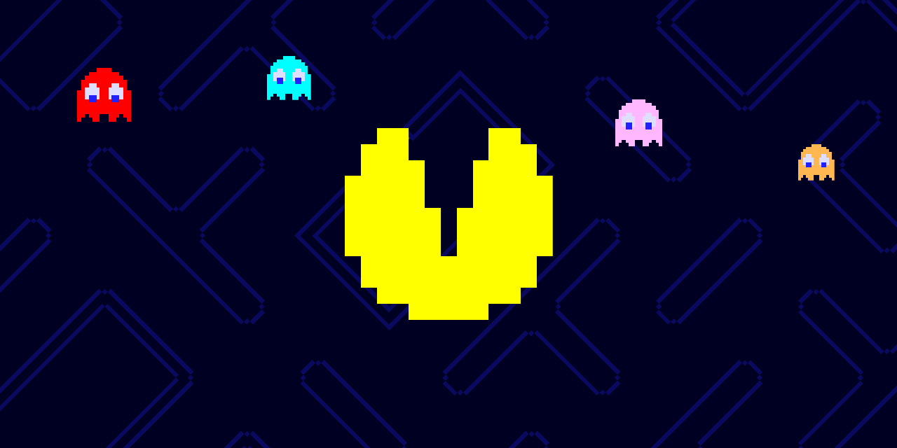

# Pacman + IA
¡Bienvenidx al repositorio del proyecto Pacman + IA!

Este repositorio tiene como propósito el preservar y demostrar el cómo la Inteligencia Artificial puede convertirse en un gran aliado a los videojuegos, en este caso aplicándose como un control para un videojuego.

Este proyecto forma parte de la entrega final del ramo de "Proyecto V" realizado por la profesora Jenny Abud de la Universidad de Chile, Semestre de Invierno, 2025.

## ¿En qué consiste?

Consiste en un videojuego inspirado en una fusión de la saga de juegos de Pacman y Space Invaders, en donde los enemigos (Fantasmas) van bajando y Pacman (el jugador, osea tú), deben evitarlos, usando tu nariz como guia donde estará nuestro protagonista.

## ¿Cómo funciona?

Usando como base el proyecto de [p5.js](https://p5js.org/) y como agregado el plugin de [ml5.js](https://ml5js.org/) se realizó el código de este proyecto usando el lenguaje de JavaScript, un lenguaje utilizado principalmente para aplicaciones e interfaces web.

## ¿Qué es ml5.js?

Es un proyecto que busca hacer que el aprendizaje automático sea accesible para todo público, sean artistas, programadores, etc.

La manera en la que este proyecto cumple su objetivo es dejando a nuestra disposición, plantillas y algoritmos pre-entrenados que se pueden utilizar como referentes para liberar la creatividad de cualquier persona interesada en esta área, ya sea para crear un proyecto similar o algo completamente distinto usando este juego como base de inspiración.

### Referencias

- Proyecto basado en los juegos de Arcade de Pacman y Space Invaders  
- Plantilla de [ml5.js - Bodypose](https://docs.ml5js.org/#/reference/bodypose)
